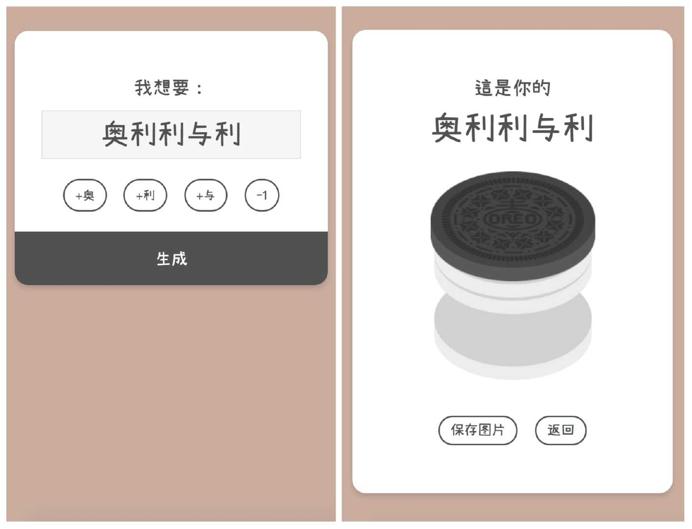

# OREOOO!

Is this your Oreooo?

[Demo](https://oreo.ddiu.io/)

[Blog](https://notes.ljl.li/oreooo/)

## Keyboard shortcuts

| Key       | Description                        |
| --------- | ---------------------------------- |
| o / r     | Input 'O' or 'RE' |
| - / Space | Input space             |
| Enter     | Generate                
| Backspace | Back                        |

## Contributing a translation

The text in Oreooo is in Chinese by default. You can translate it in your language. Just edit your language pack in `assets/js/oreo.js` and  `pull requests` to me. Thanks!

> 对中文用户：在中文版本中可能会使用繁体字形，这是由于我们使用的[濑户字体](https://www.hellofont.cn/font-detail?fontid=2646)只有繁体版本。
> 
> For Chinese users: Traditional Chinese glyphs are partially used in the Chinese version, this is because [the font we use](https://www.hellofont.cn/font-detail?fontid=2646) only contains Traditional Chinese version.

## License

MIT
